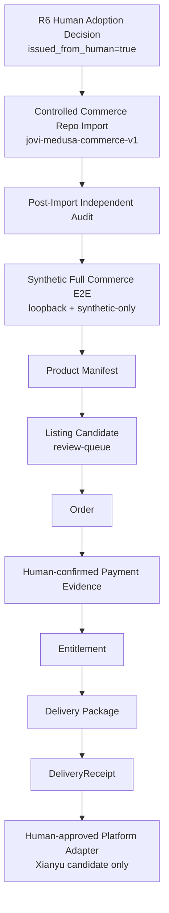

# Commerce Post-R6 Mainline Plan

**生成日期：** 2026-09-01
**性质：** 计划文档，不是 Approval / Decision / 部署许可。
**生产集成：** `production_integration_allowed=false`（保持，直到 Jovi 单独、显式地改变它）。

本文定义 R2-R2 独立审核 PASS（`MEDUSA_R2R2_PASS`）与 Jovi R6 Adoption Decision 之后，
自动售卖主线的顺序执行计划。每一步都必须保留独立的哈希绑定证据；任何一步都不授权
"跳过下一步"或"顺带做别的事"。

## 顺序总览

## 步骤定义

| 步骤 | 动作 | 证据 | 门 |
|---|---|---|---|
| R6 Human Adoption | Jovi 本人签发正式 Decision（`issued_from_human=true`），显式授权创建受控 Commerce repo 并 supersede R12 | `MEDUSA_R6_ADOPTION_DECISION_REQUEST.md` + `MEDUSA_R6_ADOPTION_DECISION_CANDIDATE.json` 审批回执 | 只有 Jovi 本人可签发；测试结果不能自动生成 |
| Controlled Commerce Repo Import | 按 `COMMERCE_REPO_V1_DESIGN_PLAN.md` 的 exact import manifest 导入 audited source subset + provenance + tests + SBOM + license；不导入 node_modules / runtime DB / Redis / secrets / customer data / cache / review-queue | import manifest、provenance 记录、逐文件 SHA、lockfile | 仅导入 audited subset；R2-R2 source tree SHA 必须可复算 |
| Post-Import Independent Audit | 全新只读会话复核导入后的仓库：hash、provenance、license scope、SBOM、test 命令、synthetic-only 边界 | 独立审核结论 PASS/FAIL | 新会话、只读、未参与导入 |
| Synthetic Full Commerce E2E | 在受控 repo 中运行 loopback synthetic X2 全链路（product → order → payment evidence → entitlement → receipt） | X2 replay、并发、负测、恢复证据 | synthetic-only；`production_integration_allowed=false` |
| Product Manifest | 生成正式产品 manifest（权利、版本、内容 SHA、定价、许可） | manifest JSON + SHA sidecar | 进入 review-queue |
| Listing Candidate | 生成清单候选（文案、图片、定价、SKU），放入 `workspace/review-queue/` | candidate JSON + 截图 + SHA | 候选不是发布 |
| Order | 真实订单只发生在 Jovi 明确批准该 SKU 之后；synthetic 阶段用 fixture 订单 | 订单记录（synthetic） | 真实订单 = 人工触发 |
| Human-confirmed Payment Evidence | 付款证据必须由 Jovi 人工确认（approver + evidence SHA + 时间 + 订单）；synthetic 路径固定 `synthetic_programmatic_mark_paid` | payment evidence 绑定记录 | 只有 Jovi 可确认付款；禁止自动收款 |
| Entitlement | 事务化签发（同一 workflow 内：读订单/付款、校验证据、写 provenance、签发 entitlement） | entitlement 记录 + provenance | R1 Policy Gate；无 bypass |
| Delivery Package | 生成确定性交付包（内容、manifest、SHA） | package.zip + package_manifest_sha256 | 交付前 entitlement 必须存在 |
| DeliveryReceipt | 签发 delivery receipt（绑定 entitlement + package manifest） | receipt 记录 + SHA | 收据是证据边界的一部分 |
| Human-approved Platform Adapter | 只有 Jovi 逐 SKU 人工批准后，才允许闲鱼适配器接受该候选（发布、消息、改价、发货、退款全部人工控制） | 人工批准记录（哈希绑定） | 真实闲鱼动作 = Jovi 人工控制 |

## 不可跨越边界

- 真实闲鱼动作（发布、回复、发货、改价、收款、退款、验证、站外导流）始终由 Jovi 人工控制；
  本计划不授权任何自动发布/自动消息/自动交付/自动退款。
- `production_integration_allowed` 保持 `false`，直到 Jovi 显式、单独批准生产集成。
- Stripe、真实支付 provider、真实客户数据、Storefront 公网暴露、n8n production 均未授权。
- R2-R1 与 R2-R2 冻结证据不得改写；后续 revision 只能新建隔离目录。
- 每一步的输出先进 `workspace/review-queue/`；权利不明、秘密或隐私内容进隔离区。

## 停止点

- 未获 Jovi R6 批准前：停在 `READY_FOR_JOVI_R6_ADOPTION_DECISION`（如 R2-R2 独立审核 PASS）。
- R6 批准后：按上表逐步骤推进，每步独立证据、独立人工确认，不允许合并跳步。
