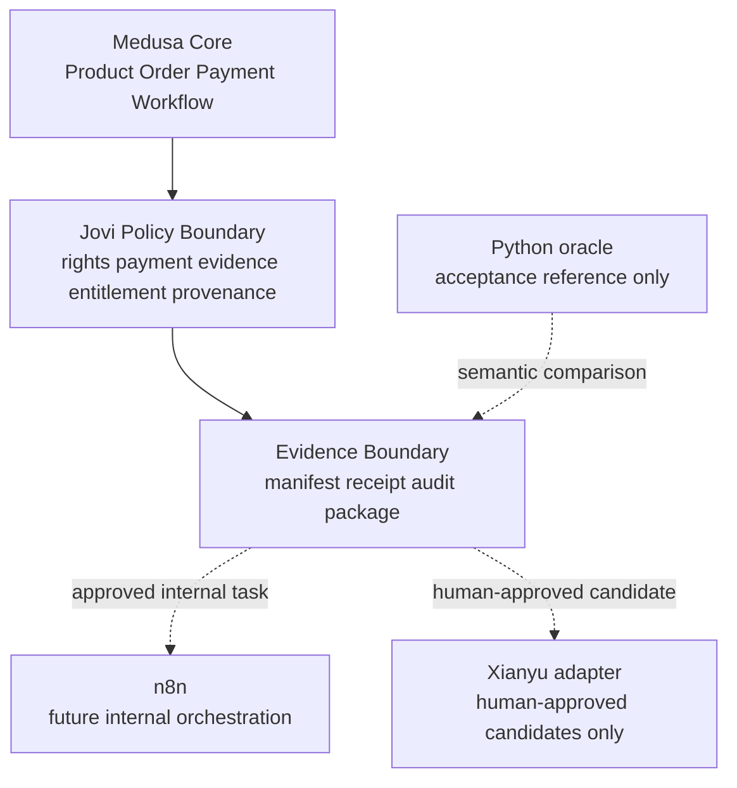

# Jovi Commerce：Medusa 采用与修复框架

**状态：** `MEDUSA_SPIKE_PASS_WITH_GAPS`（R2-R1 独立审阅 R2 已完成；尚未生产采用）
**更新日期：** 2026-09-01
**适用范围：** Medusa v2 隔离验证、Python oracle、review-queue、未来 n8n 与闲鱼适配器边界。

## 1. 当前结论

2026-08-31 的旧独立审核判定 R1–R4 全部 FAIL，`production_integration_allowed=false`；该结论和审阅记录仍保留在 [R5 审核复核记录](MEDUSA_AUDIT_R5_RESULT.md)。R2 第一轮独立审阅同样判定 `MEDUSA_SPIKE_FAIL`，详见 [R2 独立审阅 R1 结果](MEDUSA_R2_INDEPENDENT_AUDIT_R1_RESULT.md)。R2-R1 已针对这些 finding 重新实现、重建和冻结，第二轮独立审阅判定 `MEDUSA_SPIKE_PASS_WITH_GAPS`，详见 [R2 独立审阅 R2 结果](MEDUSA_R2_INDEPENDENT_AUDIT_R2_RESULT.md)。

Medusa v2.19.0 已证明 Backend、Admin、Product、Order、`pp_system` 和 Jovi 数字商品模型可以在 loopback PostgreSQL 环境运行。R2-R1 已关闭持久化写入口、synthetic provenance、付款证据、事务幂等和证据绑定的 R1–R4 synthetic 门；仍有 Jest 自然收尾和交互式 Admin smoke 两项缺口，因此尚未进入正式采用。

当前正式判定为：

- `MEDUSA_SPIKE_PASS_WITH_GAPS`
- `TECHNICAL_FEASIBILITY_PROVEN_WITH_GAPS`
- `PRODUCTION_INTEGRATION_ALLOWED=false`
- R12：`R12_NOT_EXECUTED_PENDING_JOVI_DECISION`

## 1.1 2026-09-01 R2-R1 修复候选

R2-R1 权威记录见 [MEDUSA_R2_REMEDIATION.md](MEDUSA_R2_REMEDIATION.md)，冻结包位于 `workspace/review-queue/commerce-v1/medusa-v2-spike-remediation-r2-r1/`，package manifest SHA 为 `748ec4bcc2eb7061b2280ef367e43fcc0458bb21ff46583aacf882e1cd90a4c6`，117 个成员，source snapshot tree SHA 为 `d15eb73e94a1fcf8b19ac2c8e03b317fa5ea94f7d8242548aa3eac4dec334e8d`。R2-R1 通过固定镜像 TypeScript、单元 12/12、数据库集成 5/5、X2 重放、10 并发、6 项负向、Backend PID1 SIGKILL/restart/120 秒恢复、Python oracle manifest 7/7、四项 Admin tarball/integrity/MIT scope 登记和本地 HTTP health/Admin smoke；剩余为 Jest 自然收尾与交互式浏览器 smoke 两项非阻断缺口。

## 1.2 历史 2026-08-30 修复候选

R1–R4 修复候选已冻结在 `workspace/review-queue/commerce-v1/medusa-v2-spike-remediation/`。候选使用 Node v22.17.1，从空 PostgreSQL 数据目录重建；单元测试 12/12、数据库集成测试 4/4、TypeScript 检查通过；两次 X2 返回同一 Order、Entitlement 和 Receipt，最终数据库计数为 1/1/1/1。以上仅使候选达到 `READY_FOR_INDEPENDENT_AUDIT`，R5/R6 仍未开始，不能改写为 adoption PASS。

## 2. 目标架构

### Medusa Core

直接复用 Product、ProductVariant、Order、Payment Module、Fulfillment 和 Workflow。不得在该层加入闲鱼逻辑、交付密钥、客户私密数据或自动发布行为。

### Jovi Policy Boundary

这是唯一允许签发 Entitlement 和 DeliveryReceipt 的边界。它必须在同一个事务化 Workflow 内完成：读取订单与付款状态、校验证据 SHA、校验资产权利、写入 provenance、签发 Entitlement、生成 receipt。通用 CRUD 不得成为业务写入口。

### Evidence/Adapter Boundary

只输出脱敏、哈希绑定的 JSON/receipt。Python oracle 只比较语义；n8n 未来只生成内部任务；闲鱼适配器只接收人工批准候选。三者都不得共享 Medusa 数据库或成为付款/授权权威账本。

## 3. 下一阶段：R1 采用边界修复

### R1.1 收敛持久化入口

- 新建唯一业务命令，例如 `confirmPaymentAndPrepareDelivery`。
- 在事务中重新读取 Medusa Order、PaymentCollection 和 JoviAsset。
- 未满足付款、权利或 provenance 要求时不产生任何持久化副作用。
- 禁止或封装 Entitlement/Receipt 的公共 create/update/delete。

### R1.2 synthetic provenance

Asset、Entitlement、Receipt 与最终输出必须包含：

- `environment=SYNTHETIC_X2`
- `synthetic_only=true`
- `test_run_id`
- `source_fixture_sha256`
- `real_commerce_pilot_started=false`

任何字段缺失时，状态不得升级为可供人工商业交付的候选。

### R1.3 付款证据语义

- synthetic 路径固定命名为 `synthetic_programmatic_mark_paid`。
- 真正的 `confirmManualPayment` 必须绑定 approver、evidence SHA、时间和订单。
- evidence SHA 不只做格式检查；必须绑定一个已登记、可复核的本地证据对象。
- 重复同证据调用幂等；不同证据、不同订单或已冲突状态 fail-closed。

### R1.4 原子性与幂等

- 使用稳定的 `test_run_id`/idempotency key。
- Product、Order、Payment、Entitlement 与 Receipt 的重复执行必须返回同一逻辑结果。
- 中间失败不得留下“已付款但无 Entitlement”或“有 Entitlement 但无 Receipt”的半成品。
- 增加 replay、冲突和故障注入测试。

### R1.5 可复核证据

- 在官方支持的 Node 22 LTS 上重建。
- 锁定 Medusa Tag、npm integrity、PostgreSQL digest 和 pnpm lockfile。
- 生成源码 SHA manifest、依赖清单/SBOM、测试命令、退出码和脱敏日志摘要。
- 删除 PostgreSQL 数据目录后完整重建并重跑 X2。

## 4. 阶段门

| Gate | 必须满足 | 失败结果 |
|---|---|---|
| R1 Policy Gate | 所有 Entitlement/Receipt 只能通过事务化策略入口创建 | `BLOCKED_POLICY_BYPASS` |
| R2 Provenance Gate | synthetic provenance 持久化并出现在所有终态输出 | `BLOCKED_PROVENANCE` |
| R3 Replay Gate | 重放、冲突和故障注入无部分状态 | `BLOCKED_IDEMPOTENCY` |
| R4 Evidence Gate | source/lock/SBOM/commands/results 全部哈希绑定 | `BLOCKED_EVIDENCE_BINDING` |
| R5 Independent Audit | 新会话只读复核上述四门 | `INDEPENDENT_AUDIT_FAIL` |
| R6 Human Decision | Jovi 决定是否 supersede R12 和创建正式仓库 | `NO_PRODUCTION_ADOPTION` |

## 5. 独立审核时机

R2-R1 已完成 R1–R4 冻结并由全新会话执行 R5；结果为 `MEDUSA_SPIKE_PASS_WITH_GAPS`。审核 Agent 未修改源码、证据或真实平台状态，也未把 synthetic 证据解释为生产证明。后续只需在新的隔离运行中补齐已登记的 Medium/Low 缺口，再决定是否进入 R6。

## 6. 当前阻塞与未授权事项

当前阻塞不是 PowerShell 确认，而是两个已登记的非阻断证据缺口：Jest 自然收尾和交互式 Admin smoke。尚未授权：正式 Medusa 仓库、生产部署、真实支付、真实客户、Storefront、n8n Track I、闲鱼动作或 R12 superseding Decision。Jovi 已单独授权把本项目文档提交到 `Automation_Seal` 的 root Git；这不等于授权正式 Medusa 生产仓库。

## 7.1 Git 交付状态（2026-09-01）

历史记录（2026-08-30）曾因 `.git` 为空和 remote 未知而阻止交付；该阻塞已由 Jovi 提供 `https://github.com/Jovifei/Automation_Seal.git` 并明确授权本项目 root 文档提交/合并/推送而解除。当前交付仍只包含本项目受控文档与任务记录，不包含 Medusa 外部源码、安装树、运行数据、审批、Decision 或生产集成。

## 8. 后续执行顺序

1. R1–R4 修复、证据冻结和 R5 独立审核已完成，当前结论为 `MEDUSA_SPIKE_PASS_WITH_GAPS`。
2. 后续隔离运行补 Jest 自然收尾与交互式 Admin smoke；在此之前保持 `production_integration_allowed=false`。
3. 若缺口关闭，再由 Jovi 作一次汇总 R6 adoption Decision；该 Decision 不得由测试结果自动生成。
4. 本轮只将根仓库文档/任务记录提交到已授权的 `Automation_Seal` main；不得把外部 Medusa 源码或生产状态混入此次提交。
